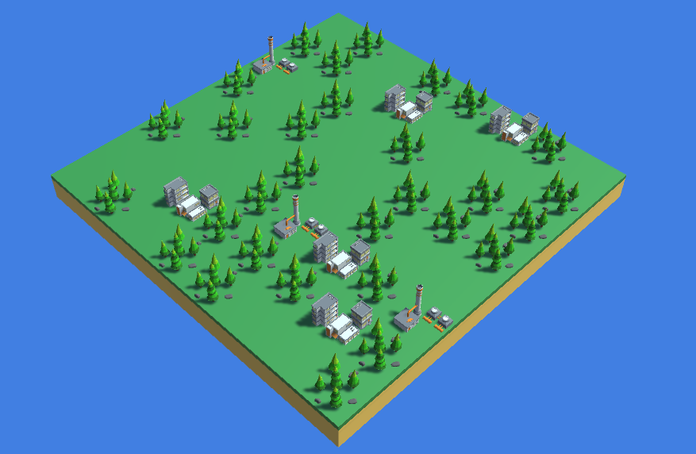

<h1 align="center">Equilibrium Island</h1>
<h3 align="center">Maintain the Balance of Nature and Civilization</h3>
 

<ul>
<li><b>Built with:</b> Unity 2020.3.21f1</li>
</ul>
 

<h2>Screenshot</h2>

<h2>To do:</h2>
<ol>
<li>Fix cell selection</li>
<li>Create an event driven turn based system</li>
<li>Figure out the algorithms to get equilibrium values</li>
<li>Implement a proper procedural generation code for initial state</li>
<li>Develop an optimized state changing system</li>
<li>Create a main menu with game story and instructions</li>
<li>Add SFX and particles</li>
</ol>
